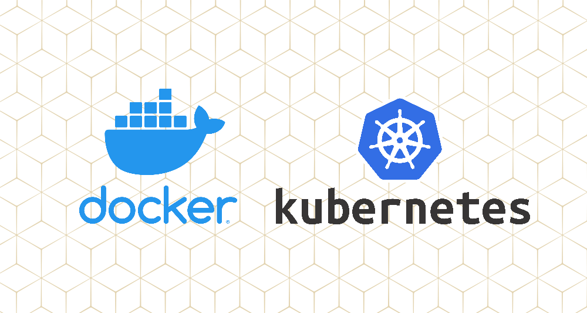
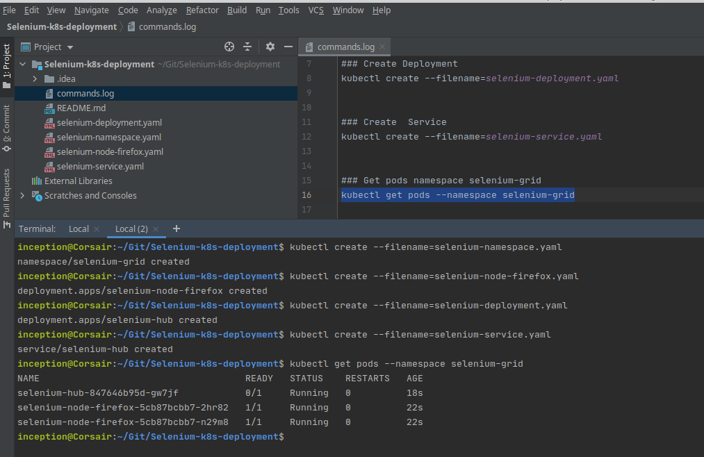
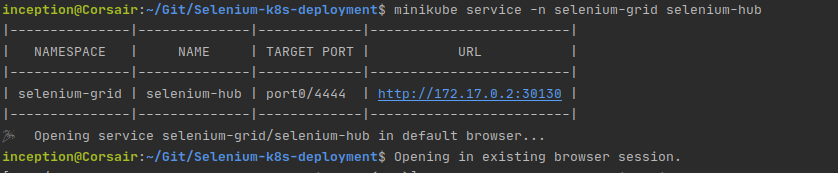
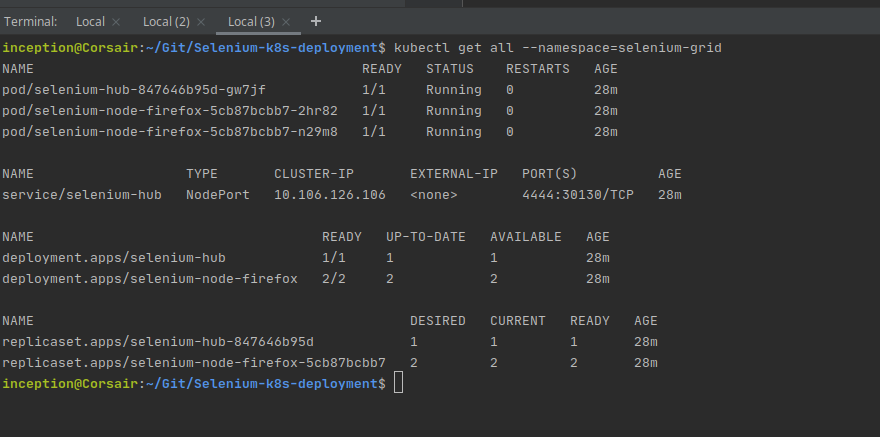
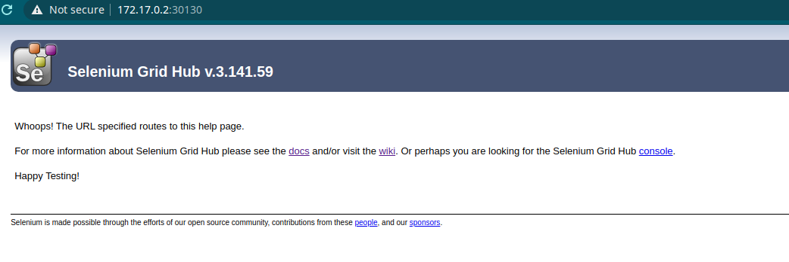
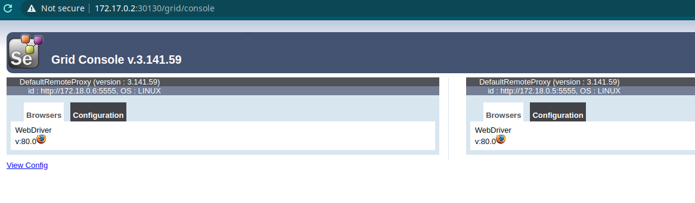

# Selenium-k8s-deployment

## Tasks:

Prepare kubernetes config files for SeleniumGrid deployment.
Please find https://github.com/SeleniumHQ/docker-selenium for additional info.
Grid should consist of 1 hub node and 2 Filefox nodes.
Kubernetes related info:
- namespace: selenium-grid;
- memory limitation: 8Gb RAM.

## How to RUN

- git clone git@github.com:maksym-butusov/Selenium-k8s-deployment.git
- cd Selenium-k8s-deployment/

## And run the next commands:

### Create namespace
kubectl create --filename=selenium-namespace.yaml

### Create Firefox pods
kubectl create --filename=selenium-node-firefox.yaml

### Create Deployment
kubectl create --filename=selenium-deployment.yaml

### Create  Service
kubectl create --filename=selenium-service.yaml

### Run Selenium Service and Selenium-hub
minikube service -n selenium-grid selenium-hub

### Check - Service, Firefox-Nodes, Deployment from namespace selenium-grid

kubectl get all --namespace=selenium-grid

## Let's move on to the result of deployment:

- Create environment

- Run selenium service and selenium-hub

- Check - Service, Firefox-Nodes, Deployment from namespace selenium-grid

- Check the result in the browser:

## Selenium-hub and two firefox nodes were deployed successfully. Thank you for your attention!
